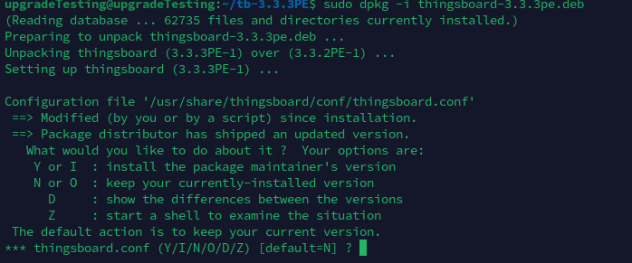
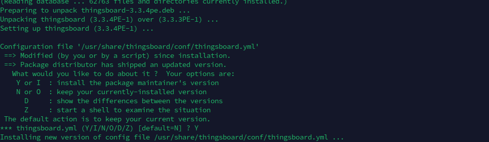
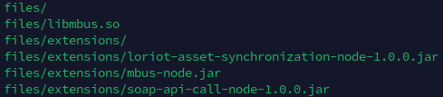

# **Upgrading thingsboard from 3.3.1PE to 3.3.2PE**

> **Note**
> If you make any changes to thingsboard.conf, thingsboard.yml, logback.xml file during the upgradation process, you might encounter the prompt below while installing thingsboard
>  
> Choose option Y because some extra configuration will be added to these files and also you may need to update these files afterwards.

**Make a directory tb-3.3.2PE and cd into it:**

```bash
mkdir tb-3.3.2PE && cd tb-3.3.2PE
```

**Download thingsboard 3.3.2PE Debian Package from the link below:**

```bash
wget https://dist.thingsboard.io/thingsboard-3.3.2pe.deb
```

**Stop Thingsboard service:**

```bash
sudo service thingsboard stop
```

**Make a backup of your database**

```bash
sudo -Hiu postgres pg_dump thingsboard > thingsboard.sql.bak
```

**Copy old configuration files**

```bash
sudo cp /usr/share/thingsboard/conf/thingsboard.conf /usr/share/thingsboard/conf/thingsboard.yml /usr/share/thingsboard/conf/logback.xml .
```

**Install thingsboard-3.3.2pe:**

```bash
sudo dpkg -i thingsboard-3.3.2pe.deb
```

**You may need to update thingsboard.yml, thingsboard.conf and logback.xml file**

```bash
sudo nano /usr/share/thingsboard/conf/thingsboard.conf
```

```bash
sudo nano /usr/share/thingsboard/conf/thingsboard.yml
```

```bash
sudo nano /usr/share/thingsboard/conf/logback.xml
```

**Execute the upgrade script:**

```bash
sudo /usr/share/thingsboard/bin/install/upgrade.sh --fromVersion=3.3.1
```

**Start thingsboard service:**

```bash
sudo service thingsboard start
```

**P.S.: if you see message like below in the terminal you can just ignore it.**

```bash
Warning: The unit file, source configuration  file  or drop-ins of thingsboard.service changed on disk. Run 'systemctl daemon-reload' to reload units.
```

# **Upgrading thingsboard from 3.3.2PE to 3.3.3PE**

**Make a directory tb-3.3.3PE and cd into it**

```bash
cd .. && mkdir tb-3.3.3PE && cd tb-3.3.3PE
```

**Download thingsboard 3.3.3PE Debian Package from the link below:**

```bash
wget https://dist.thingsboard.io/thingsboard-3.3.3pe.deb
```

**Stop Thingsboard service:**

```bash
sudo service thingsboard stop
```

**You might encounter this prompt below while installing thingsboard-3.3.3pe**


You can choose Y but it will replace old configuration with new configuration. So you need to backup your thingsboard.conf and thingsboard.yaml file.
**Also you can find the old configuration files in this folder**

```bash
/usr/share/thingsboard/conf
```

```bash
/usr/share/thingsboard/conf/thingsboard.conf.dpkg-old
/usr/share/thingsboard/conf/thingsboard.yml.dpkg-old
```

**Copy old configuration files**

```bash
sudo cp /usr/share/thingsboard/conf/thingsboard.conf /usr/share/thingsboard/conf/thingsboard.yml /usr/share/thingsboard/conf/logback.xml .
```

**Install the Debian Package**

```bash
sudo dpkg -i thingsboard-3.3.3pe.deb
```

**After the installation you need to update thingsboard.conf, thingsboard.yml, logback.xml file because all custom config will be removed after the installation**

```bash
sudo nano /usr/share/thingsboard/conf/thingsboard.conf
```

```bash
sudo nano /usr/share/thingsboard/conf/thingsboard.yml
```

```bash
sudo nano /usr/share/thingsboard/conf/logback.xml
```

after updating it save it by ctrl + o followed by enter. and ctrl + x to close it.

**Execute the upgrade script**

```bash
sudo /usr/share/thingsboard/bin/install/upgrade.sh --fromVersion=3.3.2
```

**Start thingsboard service**

```bash
sudo service thingsboard start
```

# **Upgrading thingsboard from 3.3.3PE to 3.3.4PE**

**Make a directory tb-3.3.4PE and cd into it**

```bash
cd .. && mkdir tb-3.3.4PE && cd tb-3.3.4PE
```

**Download thingsboard 3.3.4PE Debian Package from the link below:**

```bash
wget https://dist.thingsboard.io/thingsboard-3.3.4pe.deb
```

**Stop Thingsboard service**

```bash
sudo service thingsboard stop
```

**Copy old configuration files**

```bash
sudo cp /usr/share/thingsboard/conf/thingsboard.conf /usr/share/thingsboard/conf/thingsboard.yml /usr/share/thingsboard/conf/logback.xml .
```

**Install the Debian Package**

```bash
sudo dpkg -i thingsboard-3.3.4pe.deb
```

**You may need to update thingsboard.yml, thingsboard.conf and logback.xml file**

```bash
sudo nano /usr/share/thingsboard/conf/thingsboard.conf
```

```bash
sudo nano /usr/share/thingsboard/conf/thingsboard.yml
```

```bash
sudo nano /usr/share/thingsboard/conf/logback.xml
```

**Execute the upgrade script**

```bash
sudo /usr/share/thingsboard/bin/install/upgrade.sh --fromVersion=3.3.3
```

**Start thingsboard service**

```bash
sudo service thingsboard start
```

# **Upgrading thingsboard from 3.3.4PE to 3.3.4.1PE**

**Make a directory tb-3.3.4.1PE and cd into it**

```bash
cd .. && mkdir tb-3.3.4.1PE && cd tb-3.3.4.1PE
```

**Download Thingsboard 3.3.4.1PE Debian package:**

```bash
wget https://dist.thingsboard.io/thingsboard-3.3.4.1pe.deb
```

**Stop Thingsboard service**

```bash
sudo service thingsboard stop
```

**Copy old configuration files**

```bash
sudo cp /usr/share/thingsboard/conf/thingsboard.conf /usr/share/thingsboard/conf/thingsboard.yml /usr/share/thingsboard/conf/logback.xml .
```

**Install the Debian Package**

```bash
sudo dpkg -i thingsboard-3.3.4.1pe.deb
```

**You may need to update thingsboard.yml, thingsboard.conf and logback.xml file**

```bash
sudo nano /usr/share/thingsboard/conf/thingsboard.conf
```

```bash
sudo nano /usr/share/thingsboard/conf/thingsboard.yml
```

```bash
sudo nano /usr/share/thingsboard/conf/logback.xml
```

**Start thingsboard service**

```bash
sudo service thingsboard start
```

# **Upgrading thingsboard from version 3.3.4.1PE to 3.4PE**

**Make a directory called tb-3.4PE and cd into it**

```bash
cd .. && mkdir tb-3.4PE && cd tb-3.4PE
```

**Download Thingsboard 3.4PE Debian package:**

```bash
wget https://dist.thingsboard.io/thingsboard-3.4pe.deb
```

**Stop Thingsboard service**

```bash
sudo service thingsboard stop
```

**Copy old configuration files**

```bash
sudo cp /usr/share/thingsboard/conf/thingsboard.conf /usr/share/thingsboard/conf/thingsboard.yml /usr/share/thingsboard/conf/logback.xml .
```

**Install the Debian Package**

```bash
sudo dpkg -i thingsboard-3.4pe.deb
```

**You may need to update thingsboard.yml, thingsboard.conf and logback.xml file**

```bash
sudo nano /usr/share/thingsboard/conf/thingsboard.conf
```

```bash
sudo nano /usr/share/thingsboard/conf/thingsboard.yml
```

```bash
sudo nano /usr/share/thingsboard/conf/logback.xml
```

**Execute the upgrade script**

```bash
sudo /usr/share/thingsboard/bin/install/upgrade.sh --fromVersion=3.3.4
```

**Start thingsboard service**

```bash
sudo service thingsboard start
```

# Additional Logging

**To see thingsboard logs in realtime**

```bash
journalctl -fu thingsboard
```

# Place Jars and Lib Files

**Download the zip file from the link below:**

```bash
cd ..
```

```bash
wget https://raw.githubusercontent.com/mahbubul-alam-sabuj/tesenso.io-upgrade-guide/main/files.zip
```



**Install unzip:**

```bash
sudo apt install unzip
```

**Unzip files.zip:**

```bash
unzip files.zip
```

**You need to place files/extensions files to the folder below:**

```bash
/usr/share/thingsboard/extensions
```

```bash
sudo cp files/extensions/* /usr/share/thingsboard/extensions/
```

**And place libmbus.so file to /usr/share/thingsboard/bin/libs/ folder. For that you need to create a folder inside bin folder if libs folder does not exist in /bin folder.**

```bash
sudo mkdir /usr/share/thingsboard/bin/libs
```

**Then copy libmbus.so:**

```bash
sudo cp files/libmbus.so /usr/share/thingsboard/bin/libs
```

**Restart thingsboard service:**

```bash
sudo service thingsboard restart
```
